# Non-barcoded item recognition for self-checkout and regular Point-of-sale

## Problem definition
- Retailers sell up to 300 non-barcoded items
- At self-checkout customers are presented with up to 6-layers tree to pick the correct item
- Cashiers at regular Point-of-Sales are trained to remember codes or look through a book to identify the item

## Proposed solution
- Install a camera to take a photo of the item placed on a self-checkout or in POS
- Train a Neural Network 
- Use computer vision and trained NN to recognize the item
- Present the customer/cashier with reduced number of items

## Dataset
- Image-net (and Google)
- 20 classes (fruits)
- 16K+ sample images
- 90% training, 10% for validation

## Techniques used
- Deep learning
- Keras with Tensorflow backend
- Very simple Convolutional Neural Network

## Results received
- 38.2% top-1 and 80.4% top-5 accuracy (on validation set). 
- That means 80.4% of the times correct label would be in list of reduced items if 5 are shown (as in pseudo-screen above)

## Samples: 
- 5 top predictions with probabilities presented
- Green - true label (all 5 orange indicate correct label not among to 5 guesses)
- True label at the bottom of each legend
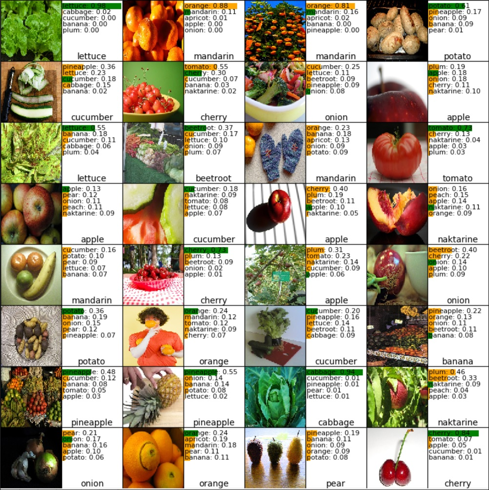

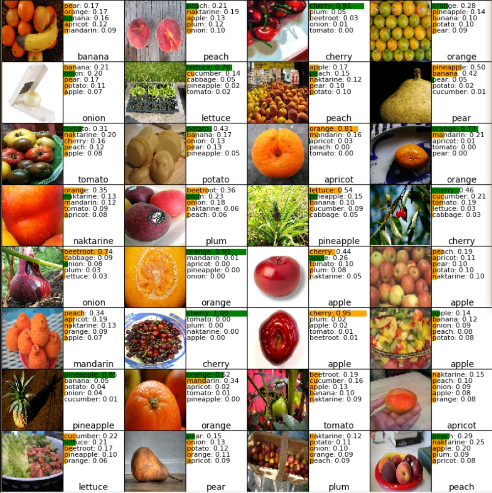
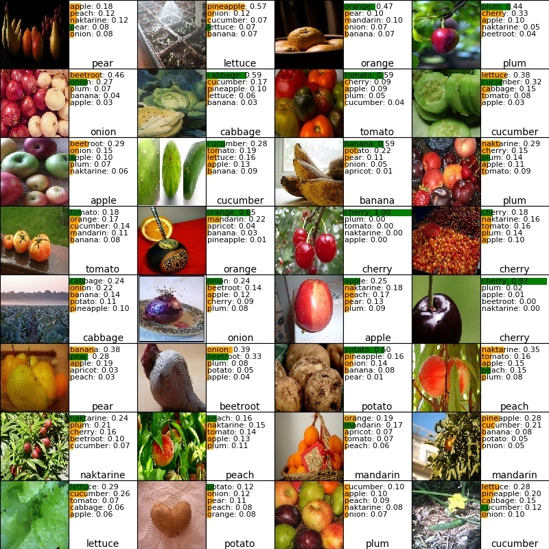

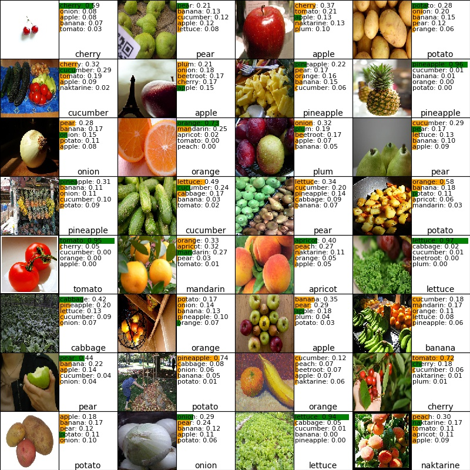

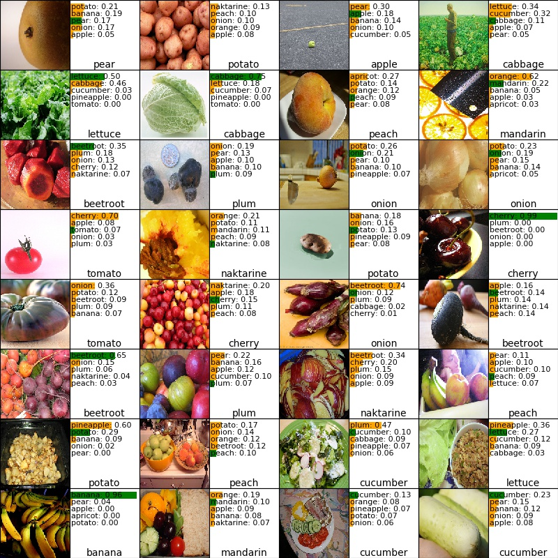
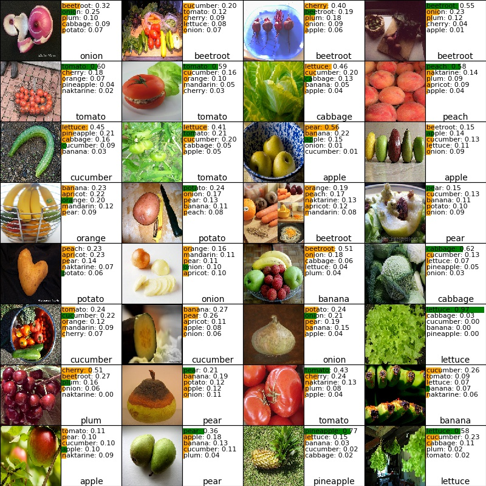
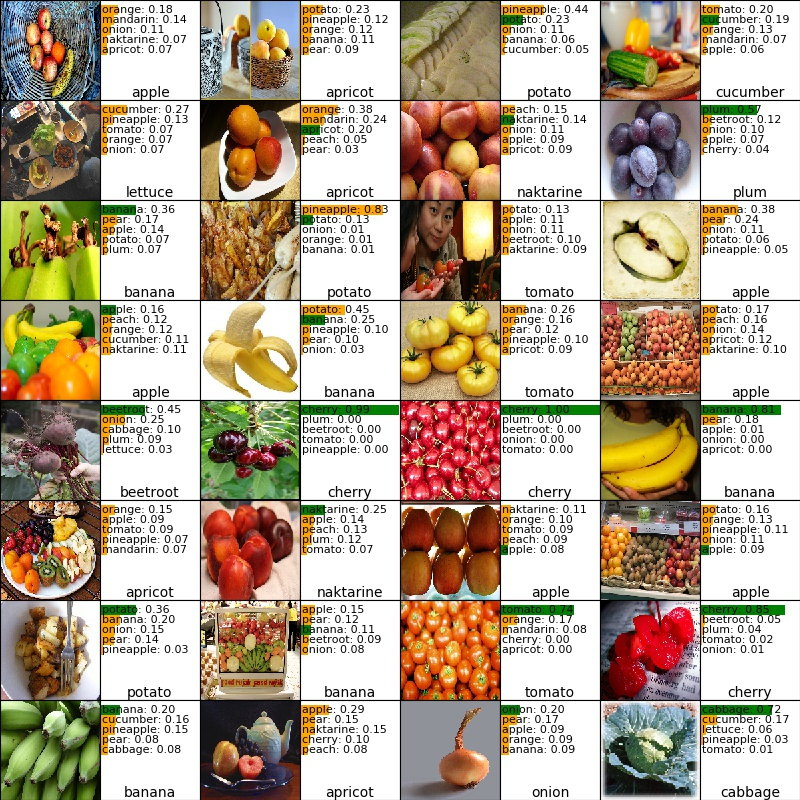
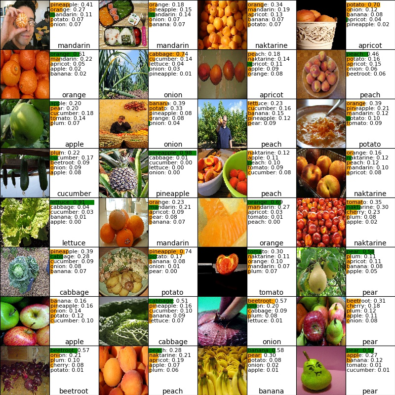

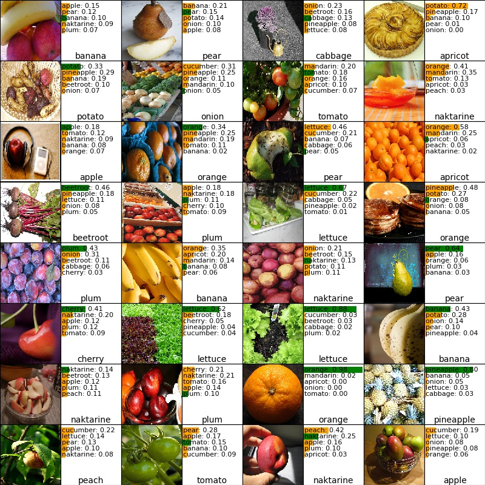

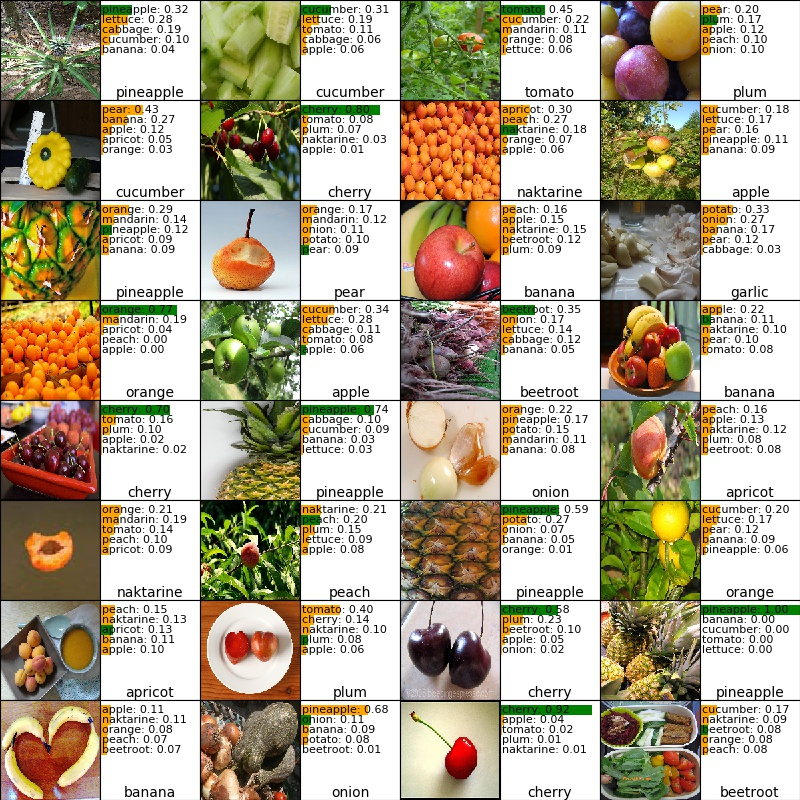

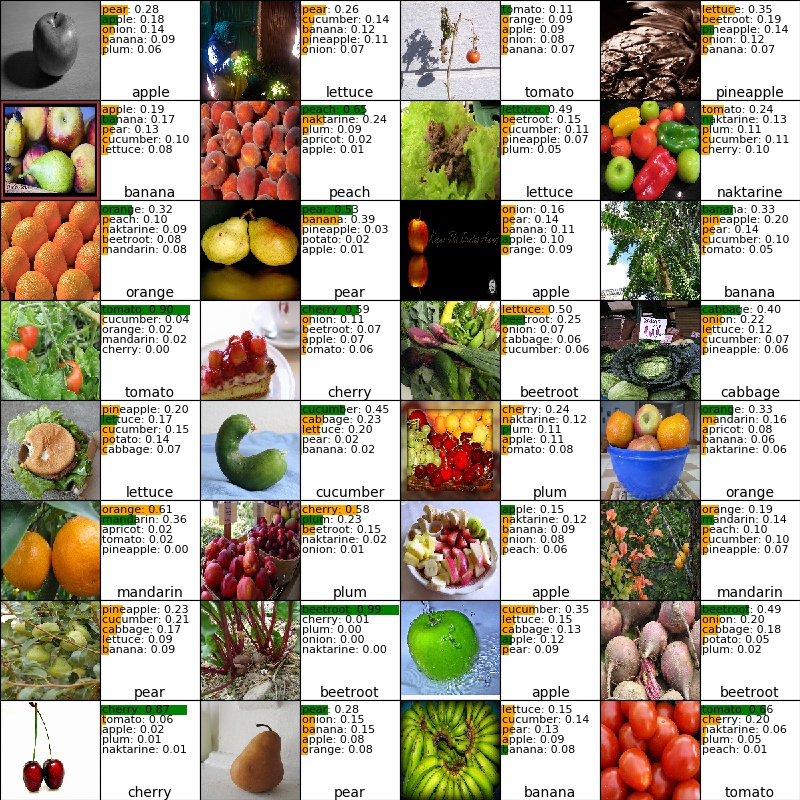

